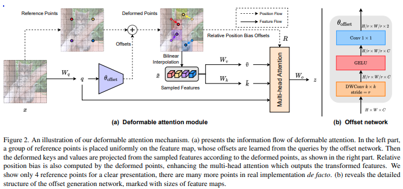

</img>

## Deformable Attention

Implementation of Deformable Attention from <a href="https://arxiv.org/abs/2201.00520">this paper</a> in Pytorch, which appears to be an improvement to what was proposed in DETR. The relative positional embedding has also been modified for better extrapolation, using the Continuous Positional Embedding proposed in SwinV2.

## Install

```bash
$ pip install deformable-attention
```

## Usage

```python
import torch
from deformable_attention import DeformableAttention

attn = DeformableAttention(
    dim = 512,                   # feature dimensions
    dim_head = 64,               # dimension per head
    heads = 8,                   # attention heads
    dropout = 0.,                # dropout
    downsample_factor = 4,       # downsample factor (r in paper)
    offset_scale = 4,            # scale of offset, maximum offset
    offset_groups = None,        # number of offset groups, should be multiple of heads
    offset_kernel_size = 6,      # offset kernel size
)

x = torch.randn(1, 512, 64, 64)
attn(x) # (1, 512, 64, 64)
```

3d deformable attention

```python
import torch
from deformable_attention import DeformableAttention3D

attn = DeformableAttention3D(
    dim = 512,                          # feature dimensions
    dim_head = 64,                      # dimension per head
    heads = 8,                          # attention heads
    dropout = 0.,                       # dropout
    downsample_factor = (2, 8, 8),      # downsample factor (r in paper)
    offset_scale = (2, 8, 8),           # scale of offset, maximum offset
    offset_kernel_size = (4, 10, 10),   # offset kernel size
)

x = torch.randn(1, 512, 10, 32, 32) # (batch, dimension, frames, height, width)
attn(x) # (1, 512, 10, 32, 32)
```

1d deformable attention for good measure

```python
import torch
from deformable_attention import DeformableAttention1D

attn = DeformableAttention1D(
    dim = 128,
    downsample_factor = 4,
    offset_scale = 2,
    offset_kernel_size = 6
)

x = torch.randn(1, 128, 512)
attn(x) # (1, 128, 512)
```

## Citation

```bibtex
@misc{xia2022vision,
    title   = {Vision Transformer with Deformable Attention}, 
    author  = {Zhuofan Xia and Xuran Pan and Shiji Song and Li Erran Li and Gao Huang},
    year    = {2022},
    eprint  = {2201.00520},
    archivePrefix = {arXiv},
    primaryClass = {cs.CV}
}
```

```bibtex
@misc{liu2021swin,
    title   = {Swin Transformer V2: Scaling Up Capacity and Resolution},
    author  = {Ze Liu and Han Hu and Yutong Lin and Zhuliang Yao and Zhenda Xie and Yixuan Wei and Jia Ning and Yue Cao and Zheng Zhang and Li Dong and Furu Wei and Baining Guo},
    year    = {2021},
    eprint  = {2111.09883},
    archivePrefix = {arXiv},
    primaryClass = {cs.CV}
}
```
